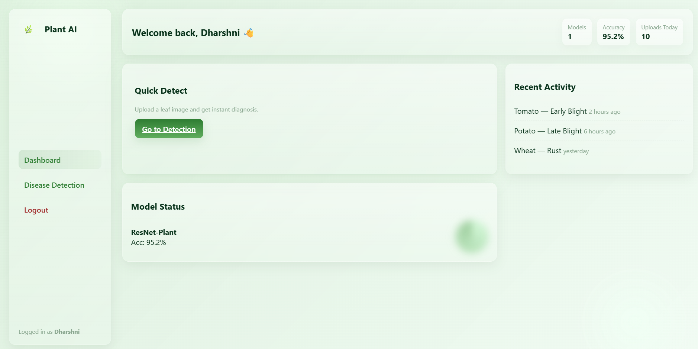
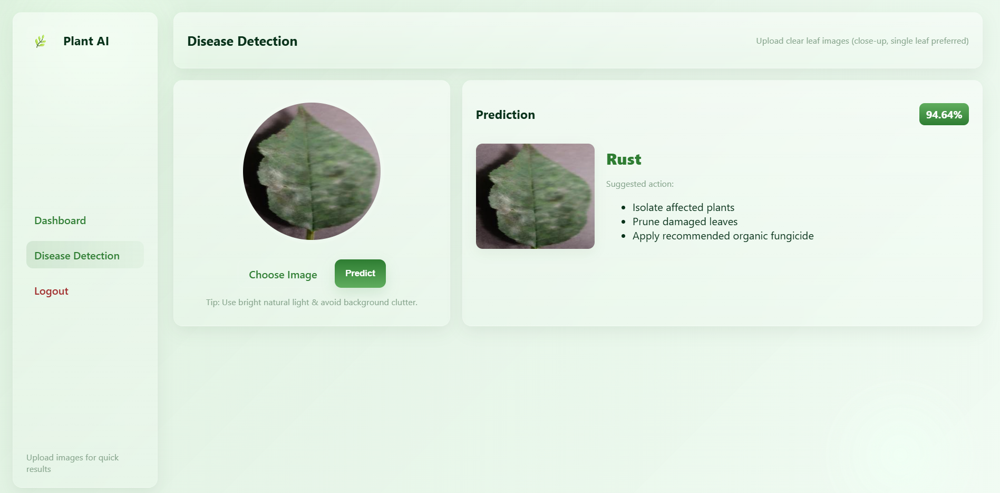

# SMART-AGRI-4.O
# 🌱 Plant Disease Detection System

This project is an AI-based Plant Disease Detection System developed as a mini project.

## 📌 Overview
- Plant disease detection using CNN concepts
- Flask-based web application
- Image upload and prediction workflow
- Confidence score display

## 🧠 Technologies Used
- Python
- CNN (Deep Learning)
- Flask
- HTML, CSS, JavaScript

## 📂 Project Structure
- app.py – Flask backend
- prediction.py – Prediction logic
- notebook_runner.py – Supporting script
- templates/ – HTML files
- static/ – CSS, JS, uploads
- Project report and presentation

## ⚠️ Note
Model training is explained conceptually and can be extended as a future enhancement.

## 📸 Website Outputs

### 🔐 Login Page

### 📊 Dashboard

### 🌿 Disease Detection and Prediction Page

## 👩‍💻 Developed By
Dharshni V M
